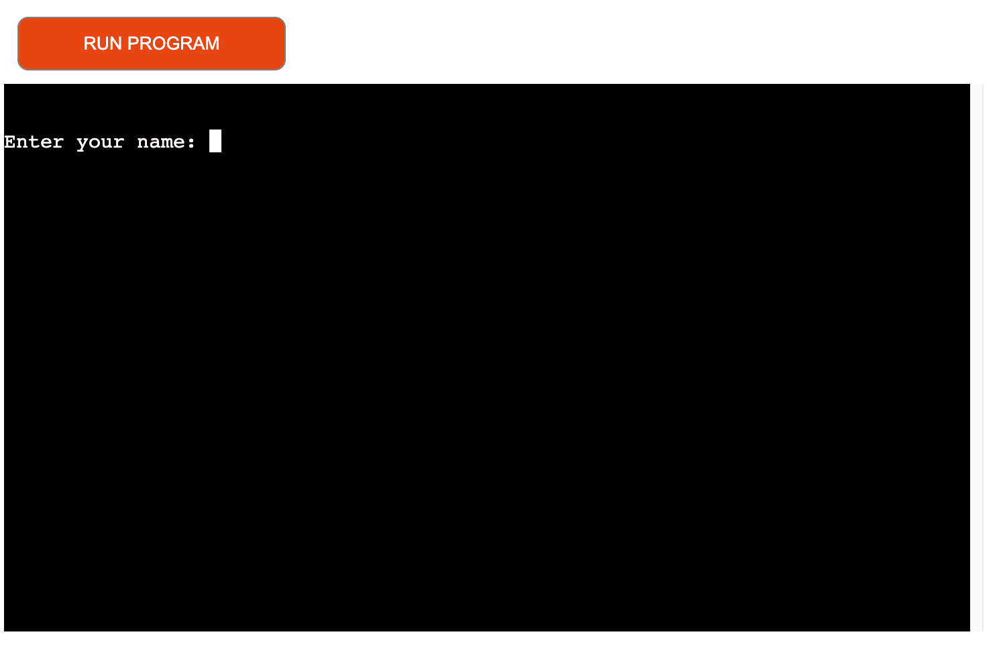

# Hangman

Welcome to the Hangman game! This is a simple Python console-based game where players try to guess a hidden word by guessing a letter or attempting to guess the word in its entirety. Traditionally, Hangman is a two player game, however in this instance the player will play against the computer using Python. In this instance, the computer will check if the player's guesses are correct, incorrect, invalid, or if the letter has been guessed already.

With each incorrect guess, a part of a hangman is drawn. Letters or words which are incorrectly guessed are then displayed for players feedback, with an additional acknowledgement message printed in line with their guess.

With each correct guess, the letters or words guessed are displayed for players feedback, with an additional acknowledgement message printed in line with their successful guess. 

Letters which have already been guessed, or are not present in the word being guessed, will be highlighted for player feedback and the player will be invited to try again.

The player wins if they successfully guess the word before the hangman is fully drawn. 

[Click here to go to the live website!](https://hangman-portfolio-project-a242294ea4a2.herokuapp.com) 

## Table of contents 

1. [Plans and structure](#plans-and-structure)
    - [Objectives](#objectives)
    - [Changes throughout the process](#changes-throughout-the-process)
2. [Features](#features)
    - [Opening page](#opening-page)
    - [Instructions and Game](#instructions-and-game)
    - [Game Play](#game-play)
    - [Losing message](#losing-message)   
    - [Winning message](#winning-message) 
    - [Extra features](#extra-features)
3. [Testing](#testing)
    - [Python](#python)
    - [Manual Testing](#manual-testing)
    - [Bugs](#bugs)
4. [Deployment](#deployment)
6. [Credits](#credits)
    
## Plans and structure 

### Objectives

- Game Play: I want to implement the Hangman game mechanics, including choosing a random word, displaying placeholders for the letters, and allowing the player to guess letters. 
    - Did you achieve this?
        - Yes
    - How did you achieve this?
        - The Hangman game implementation in Python involves choosing a random word from a predefined list, displaying placeholders for each letter in the word, and allowing the player to guess letters. The game continues until the player correctly guesses the word or runs out of attempts. The code includes functions for selecting a random word, displaying the current state of the word, and handling player guesses. It also includes a number of print messages which display in line with the players correct or incorrect guesses.
                        
 - Difficulty Levels: I want to include multiple difficulty levels (easy, medium, hard) with varying word lengths to stimulate player engagement and add to the challenge. 
    - Did you achieve this?
        - Yes
    - How did you achieve this?
        - The implementation of difficulty levels in the Hangman game creates distinct difficulty settings (easy, medium, hard) with specific word length ranges. Players can choose their preferred difficulty level at the very beginning of the game (indicated using Y/N), which influences the complexity of the game by adjusting the word lengths and challenge of the game. The words aligned to the players selection of difficulty is called by 'from word' function and are randomized. 

- Hangman Art: I want to add a variety of hangman art for different stages of the game, making it visually appealing..
    - Did you achieve this?
        - Yes
    - How did you achieve this?
        - To visually enhance the Hangman game, I incorporated graphical representations for different stages of the game, progressively revealing the hangman's visual depiction with each incorrect guess, creating a more engaging and immersive experience. The player has six attempts to guess the word, therefore the Hangman stages align with each of these six attempts and an updated Hangman state is displayed with each guess made by the player.

- Hangman Rules and Guidance: I want to integrate clear and concise rules within the Hangman game interface to provide players with guidance on how to play, including instructions on guessing, limitations on incorrect attempts, and any additional game-specific rules
    - Did you achieve this?
        - Yes
    - How did you achieve this?
        - I implemented clear and user-friendly in-game rules for the Hangman game at the beginning of the game. These rules were clearly labelled and numbered accordingly to ensure the player was aware how to play and emphasizing the need for players to guess the word within six attempts to enhance player understanding and engagement

- Replay Game Option: Enable a seamless game replay experience by implementing an option that allows players to play again, fostering user engagement and allowing for continuous gameplay enjoyment.
    - Did you achieve this?
        - Yes
    - How did you achieve this?
        - I achieve play_again functionality by adding the function to the main Hangman game logic that checks if the player desires to play again. After completing a game, the player is prompted to input as to whether they want to play again, and if so, the game variables are reset to begin a new round while maintaining an intuitive and enjoyable user experience.

### Changes throughout the process

Throughout the process of making this project, I decided to add some features which vary from my original mockup designs to add further functionality to the Hangman game and to heighten user experience. 

- Originally, I intended to have a simple overview of the Hangman game.
- Originally, I also hadn't accounted for the displaying of letters which had been already guessed

As I navigated this project, I noted the importance of including these features as an intrinsic part of building a more responsive, fully rounded Hangman game which would ensure the game was more responsive to users needs and their overall experience. As such, I adapted the inital overview message to include a sequenced list of rules to guide the user through how to play the Hangman game, and the conditions attached to the maximum attempts available. Further more, I adapted my code to ensure that letters already guessed by the user were displayed with a print message guiding the user on the same and ensuring they could guess an alternative letter. 

Go back to [Table of contents](#table-of-contents) 

## Features 

### Opening page
- This is the first page you see when the app loads. On this page there is a prompt for the player to enter their name to begin the game. 

- The player is then asked to select their difficulty 

- The player is then asked to verify they wish to play using the Y/N feature 

### Instructions and Game
- The instructions page explains to the user how the game is played and then initiates display of the inital game state. The inital hangman state shows the player the lenght of the word they are guessing and asks them to enter a letter or guess a word

### Game Play
- While the user is playing the game page, the Hangman game returns messages for letters which are incorrectly guessed, correctly guessed,and letters which have already been guessed. The assoicated letter will be clearly reflected in the message to the player, along with the current state of the hangman

### Losing message
- If a player runs out of guesses, they will receive a message highlighting this. They will also be invited to replay should they wish to do so.

- If a player guessed the incorrect word, they will receive a message detailing the word they attempted to guess, the correct word, and invited to replay again

### Winning message
- If the user guesses all letters correctly or guessed the word correctly, they will receive a congratulatory message and are invited to choose if they wish to play again.

### Extra features
- I added additional features to the game to include; invalid difficulty selection; invalid input entry, and incorrect word guess to support a more user friendly experience and a more innovative gameplay experience

1. An invalid difficulty selection will prompt the user to start again

2. An invalid input entry, that other than a letter or letters, will print a message and ask the user to try again

2. An incorrect word guess will print a message and invite the user to play again

Go back to [Table of contents](#table-of-contents)

## Testing

### Python
Python was tested using PEP8 [PEP8 validator](http://pep8online.com/) 

The Python code passed the PEP8 validator:

### Manual Testing 
To manually test my Hangman game, I completed the following steps:

1. Run the Game:
- Start by running the game and check for any immediate errors during execution.

2. Input Validation - Difficulty:
- Enter different difficulty levels (easy, medium, hard) and ensure the game responds appropriately. Check if it handles case-insensitive input.

3. Game Instructions:
- Verify that the game provides clear and understandable instructions to the player.

4. Word Selection:
- Confirm that the game selects a word based on the chosen difficulty level.

5. Letter Guessing:
- Guess letters one by one and check if the game correctly updates the word completion and displays the hangman stages. Test both correct and incorrect guesses.

6. Word Completion Update:
-vSpecifically, test the update_word_completion function by manually updating the word completion with various correct letter guesses.

7. Hangman Stages Display:
- Check that the hangman stages are displayed correctly based on the number of incorrect attempts.

8. Word Guessing:
- Attempt to guess the entire word. Confirm that the game responds appropriately by either updating the word completion or deducting attempts.

9. Multiple Games:
- Play the game multiple times to ensure that the loop for playing again works as intended. Check if it resets variables and allows for a new game.

10. Invalid Inputs:
- Intentionally enter invalid inputs (non-alphabetic characters, numbers) during letter and word guessing to verify that the input validation is effective.

11. Exit Game Loop:
- Test the option to exit the game loop without playing again by entering something other than 'Y' when prompted.

### Bugs 
Debugging is a critical step in identifying and responding to issues with your code. Here are some of the steps I followed throughout this process:

1. Understand the Code:
- Start by reading through my code and understanding its logic and structure. Identify the purpose of each function and the overall flow of the program.

2. Run the Code:
- Execute my script and observe any immediate errors that might occur during runtime. Check if the script runs without crashing.

3. Check for Syntax Errors:
- Look for syntax errors indicated by error messages, issues in relation to incorrect indentation and typos or grammatical errors in variable/function names were issues which had to be rectified. 

4. Print Statements:
- Introduce print statements strategically at different points in my code to output the values of variables and help me understand the flow of execution. 

5. Review Variable Assignments:
- Ensure that variables are assigned the correct values and have the appropriate initial values. Check for any variables that might not be updated as expected.

6. Function Calls:
- Check if functions are called with the correct arguments, and verify that the return values are used appropriately where needed.

7. Hangman Stages Display:
- Inspect the display_hangman function and make sure it correctly displays the hangman stages based on the number of attempts.

8. Word Completion Update:
- Review the update_word_completion function to confirm that it correctly updates the word completion based on a correct letter guess.

9. Check for Logic Issues:
- Identify logical errors in conditional statements and loops, paying attention to the conditions under which certain code blocks are executed.

10. Input Validation:
- Test the input validation in the handle_letter_guess and handle_word_guess functions to ensure it correctly identifies and handles valid and invalid inputs.

11. Exception Handling:
- Verify that the try-except block in the get_word function correctly catches and handles the ValueError when an invalid difficulty level is entered.

12. Word Guess Handling:
- Inspect the logic for handling word guesses, ensuring it correctly updates the game state and responds appropriately when the user guesses the entire word.

13. Game Loop:
- Check the game loop in the main function. Verify that it allows for multiple games and handles the option to exit the loop correctly.

Go back to [Table of contents](#table-of-contents)

## Deployment 

There were many steps to deploying this project to Heroku:

1. If I had installed any packages to Gitpod, I would need to add then to a list of requirements. 
- To do this I would have typed pip3 freeze > requirements.txt and hit enter, this would update the requirements.txt file.
- I'd need to commit and push this to Github.
- Heroku will use this list to install the dependencies into the application before the project is run.
- However, I didn't need to do this as I had no packages installed.
2. I went over to my Heroku dashboard and clicked on 'create a new app'.
3. I chose a name for my app; every app must have a unique name so I couldn't call it hangman as this was already taken so I went for hangman-portfolio-project.
4. Selected my region and clicked create app. 
5. I then went to the tab at the top of the page and clicked on settings. 
6. Some apps will include sensitive data in the gitpod workspace that isn't in the github repository because it has been deliberately protected in the gitnore.file. I didn't have any sensitive data to protect but if I had done, I would have needed to create a config var to allow Heroku access to this data. 
 - To do this, I would have clicked reveal config vars.
 - Filled in the key for example: CREDS
 - Then copy and pasted the contents of that 'CREDS' file into the value field and clicked add. 
7. I added the buildpacks needed by clicking on the buildpack button.
 - Here I selected python and pressed save changes.
 - Then repeated the same process but selected nodejs this time.
 - Making sure it was done in that order with python at the top and nodejs under.
8. I scrolled back up to the tab at the top and clicked deploy.
9. I selected github as the deployment method and clicked connect to github.
10. Once this is selected, I then searched for my github repository name, and connected to the correct repository.
11. Then I scrolled down, here there were two options.
 - The first option being to enable automatic deployment, which means that Heroku will rebuild the app every time I pushed a change to github.
 - The other option being to manually deploy, which is the choice I went for initally, however automatic deployments were selected following this to make it easier.
12. When all the code is received from github there is a view button that it a link to the running app, I clicked this to make sure everything was running as expected.

Go back to [Table of contents](#table-of-contents)

## Credits 

- [random word generator](https://randomwordgenerator.com/) - I used this site to generate a list of random words for various difficulties.
- [code beautifier](https://codebeautify.org/python-formatter-beautifier) - To tidy up my code and present it neatly.
- [PEP8 validator](http://pep8online.com/) - was used to check the code was valid.
- Youtube - I watched many different youtube videos on how to make hangman using python and found them to be most interesting and useful.
- Marcel - My mentor Marcel was so helpful and supported me in building confidence with the task at hand

Go back to [Table of contents](#table-of-contents)
